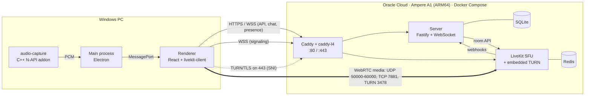

# LeTopeiras Client

[](https://github.com/PedroMaxis/LeTopeirasClient/actions/workflows/ci.yml)
[](https://github.com/PedroMaxis/LeTopeirasClient/releases/latest)
[](LICENSE)

A private, self-hosted Discord-style app for a group of friends: text chat, voice channels and 1080p60 screen sharing **with the PC's audio, without echoing the call back**. The whole backend runs at zero cost on Oracle Cloud's free tier.

> **Instalando como amigo do grupo?** Pule para [Para os amigos (PT-BR)](#para-os-amigos-pt-br).

## Features

- **Text chat:** channels and categories, edit and delete, infinite scroll, unread markers, `@mentions` (including `@todos` for everyone) with autocomplete, emoji picker and native Windows notifications.
- **Voice:** one-click channels, mute and deafen, input and output device selection, an optional voice gate with a level meter, per-user volume up to 200 %, speaking indicators and ping.
- **Screen share:** 1080p60 H.264 with a custom source picker, "game" or "text" modes, and the PC's audio captured per app or for the whole system.
- **Roles and private channels:** colored tags assigned by the admin. Private channels only open for members with one of their tags. Losing access applies immediately, including being removed from a voice call.
- **Invite-only sign-up**, presence (online and idle), typing indicators, and automatic reconnection of both the chat socket and the media session.
- **Desktop app:** frameless window, minimize to tray, start with Windows, and background auto-updates from GitHub Releases.

## Engineering highlights

### Sharing the PC's audio without sending the call back

Capturing "what the PC is playing" naively also captures your friends' voices playing in the app, so they would hear themselves. The capture is a small **C++ N-API addon** (`native/audio-capture`) built on Windows' **process loopback** API (`ActivateAudioInterfaceAsync` with `AUDIOCLIENT_ACTIVATION_PARAMS`):

- **Full-screen share:** captures everything **except** the app's own process tree (`PROCESS_LOOPBACK_MODE_EXCLUDE_TARGET_PROCESS_TREE`).
- **Window share:** captures **only** that window's process tree, so a game's sound goes out but a music player doesn't.

The PCM (float32, 48 kHz stereo, 10 ms blocks) flows from main to renderer over a `MessagePort`, then into an `AudioWorklet` with a small jitter buffer, and is published to LiveKit as the screen share's audio track. Being N-API, the same binary loads in Node and Electron without rebuilding.

### Self-hosted SFU on a free ARM instance

Media goes through a self-hosted **LiveKit** SFU on an Oracle Ampere A1 (ARM64) instance, behind **Caddy** with automatic Let's Encrypt certificates. The free tier's Security List only opens 80, 443, 7881 and a few UDP ports, so **TURN over TLS shares port 443 with HTTPS**: Caddy is built with `caddy-l4`, whose listener wrapper peeks at the TLS SNI. Connections for the TURN domain are decrypted and handed to LiveKit's TURN listener, with a PROXY protocol header carrying the client IP. Everything else continues to the normal HTTP server. Clients on strict networks (mobile carriers, corporate firewalls) still connect through UDP TURN, ICE/TCP or TURN/TLS on 443.

### One access rule, enforced end to end

Permissions boil down to a single `canAccess` function, implemented on the server and mirrored on the client. The WebSocket gateway only sends a channel's messages, typing events and voice state to members who pass it. Anything that changes access (tags, privacy, a member's roles) pushes a fresh state to everyone and removes members from voice rooms they can no longer enter, through the LiveKit server API.

### Also worth a look

- **Shared protocol:** every WebSocket event and REST body is a `zod` schema in `packages/shared`, validated on both sides.
- **Remote audio mixing:** one `AudioContext` with a gain per source, which gives per-user volume, local mute of a screen share's audio, deafen, and output device selection with `setSinkId`.
- **Optimistic chat:** sends carry a nonce and show up immediately. After a reconnect, in-flight messages are marked as failed instead of being resent blindly.
- **Hardened Electron:** `contextIsolation`, `sandbox`, no `nodeIntegration`, a strict CSP, every IPC handler checks the sender frame, and permissions are denied by default.

## Architecture



Chat, presence and typing go over the app's own WebSocket. LiveKit only carries media, and its webhooks keep the server's view of who is in which voice channel up to date.

## Tech stack

| Area            | Choice                                                                                       |
| --------------- | -------------------------------------------------------------------------------------------- |
| Desktop client  | Electron 44, React 19, TypeScript, electron-vite                                             |
| Real-time media | LiveKit (self-hosted SFU), `livekit-client`                                                  |
| Backend         | Node.js 24, Fastify 5, `@fastify/websocket`, SQLite (`better-sqlite3`), argon2               |
| Protocol        | `zod` schemas shared by client and server                                                    |
| Native code     | C++ N-API addon, Windows process loopback (WASAPI)                                           |
| Infrastructure  | Docker Compose on Oracle Cloud Always Free (ARM64), Caddy + caddy-l4, Let's Encrypt, DuckDNS |
| Distribution    | electron-builder (NSIS) and electron-updater from GitHub Releases                            |
| Tooling         | pnpm workspaces, Vitest, ESLint, Prettier, GitHub Actions                                    |

## Repository layout

```
apps/client           Electron app (main, preload, renderer)
apps/server           Fastify API + WebSocket gateway + SQLite
packages/shared       zod schemas, types and constants for the protocol
native/audio-capture  C++ addon: per-process system audio capture
infra/                Production stack: Compose, Caddyfile, LiveKit config, scripts
```

## Running locally

Requirements: Node 24, pnpm, and Windows for the client. The server also runs on Linux and macOS.

```sh
pnpm install
cp apps/server/.env.example apps/server/.env
pnpm --filter @letopeiras/server create-admin <username>   # prints a random password
pnpm dev                                                   # Electron client + server
```

For voice, run a local LiveKit with `livekit-server --dev --bind 127.0.0.1`. The example `.env` already matches its dev keys.

```sh
pnpm lint && pnpm typecheck && pnpm test
pnpm --filter @letopeiras/client dist:win   # local installer in apps/client/dist/
```

## Deploying and releasing

- **Server:** [`infra/README.md`](infra/README.md) covers the deploy, logs, daily SQLite backups and outbound traffic monitoring.
- **Client:** bump `version` in `apps/client/package.json`, commit, then push a matching tag (`git tag v0.2.0 && git push origin main v0.2.0`). The **Release** workflow builds the installer and publishes it, and installed apps update themselves.

## Known limitations

- Windows only (10 version 2004 or newer, or 11): the system audio capture relies on Windows' process loopback API.
- The installer isn't code-signed, so SmartScreen warns on first install.
- The screen share currently falls back to Chromium's software H.264 encoder (OpenH264), which costs CPU at 1080p60. Simulcast is part of the cause, since hardware encoders don't do H.264 simulcast, but not all of it; still under investigation.

## Para os amigos (PT-BR)

### Instalar

1. Baixe o `LeTopeiras-Client-Setup-<versão>.exe` da [última release](https://github.com/PedroMaxis/LeTopeirasClient/releases/latest).
2. Rode o instalador. O executável não é assinado, então o Windows mostra um aviso do SmartScreen na primeira vez: clique em **Mais informações** → **Executar assim mesmo**. O navegador também pode avisar no download; é só manter o arquivo.
3. Abra o app, clique em **Criar conta** e use o código de convite que você recebeu. Cada código vale para uma pessoa.

Precisa de Windows 10 versão 2004 ou mais nova, ou Windows 11.

### Atualizações

O app procura versões novas ao abrir e a cada 4 horas, e baixa em segundo plano. Quando uma estiver pronta, aparece **Reiniciar e atualizar**. Se você ignorar, ela é instalada na próxima vez que o app fechar pelo **Sair** da bandeja.

Fechar a janela só esconde o app na bandeja (perto do relógio). Para fechar de verdade: clique com o botão direito no ícone da bandeja → **Sair**.

## License

[MIT](LICENSE) © 2026 Pedro Sales
